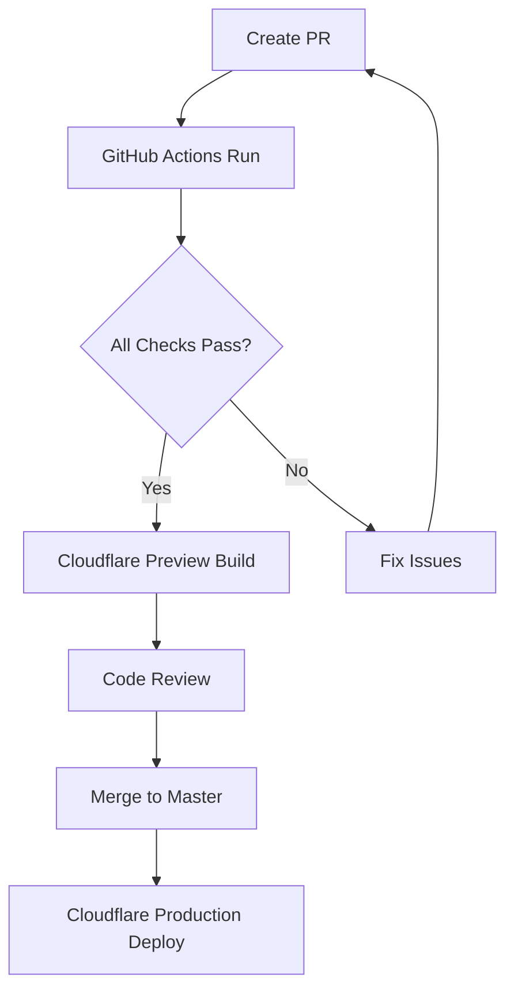

# GitHub Actions & Cloudflare Pages Setup Guide

## 🎯 **Recommended Setup (Current is Best Practice)**

Your current GitHub → Cloudflare Pages connection is **perfect**! The GitHub Actions will enhance your workflow without changing the deployment process.

## 📋 **Setup Checklist**

### **1. Keep Current Cloudflare Pages Setup** ✅
- [x] Repository connected to Cloudflare Pages
- [x] Auto-deployments on push to `master`
- [x] Preview deployments on PRs
- [x] Build command: `pnpm build`
- [x] Output directory: `dist`

### **2. Configure GitHub Secrets** (Required)
Add these secrets to your GitHub repository (`Settings` → `Secrets and variables` → `Actions`):

```bash
# Required for Cloudflare API access (optional - for enhanced deployment control)
CLOUDFLARE_API_TOKEN=your_cloudflare_api_token
CLOUDFLARE_ACCOUNT_ID=your_cloudflare_account_id

# Auto-generated by GitHub (no action needed)
GITHUB_TOKEN=automatically_provided
```

**Note**: The Cloudflare secrets are optional since you already have direct GitHub integration.

### **3. Repository Settings**
Configure these settings in your GitHub repository:

**Branch Protection Rules** (`Settings` → `Branches`):
- [x] Require status checks before merging
- [x] Require branches to be up to date
- [x] Include administrators
- [x] Required status checks:
  - `Quality Checks`
  - `Security Scanning / Dependency Vulnerability Scan`
  - `Medical Safety Code Review` (for medical calculation changes)

**General Settings**:
- [x] Allow auto-merge
- [x] Delete head branches after merge
- [x] Squash merging enabled

### **4. Dependabot Configuration** ✅
The `.github/dependabot.yml` is configured for:
- Weekly dependency updates
- Grouped security updates
- Medical-critical dependency manual review
- Auto-merge for safe patch updates

## 🔄 **Workflow Overview**

### **Development Workflow:**


### **What Each GitHub Action Does:**

**1. CI/CD Pipeline (`.github/workflows/ci.yml`)**
- ✅ TypeScript type checking
- ✅ Code quality validation
- ✅ Security scanning
- ✅ Medical calculation tests
- ✅ E2E testing
- ✅ Performance auditing
- 🚫 **Does NOT interfere with Cloudflare deployment**

**2. Security Scanning (`.github/workflows/security.yml`)**
- 🔍 Dependency vulnerability scanning
- 🔍 Secret detection
- 🔍 OWASP ZAP security testing
- 🏥 Medical safety code review automation

**3. Dependabot Auto-merge (`.github/workflows/dependabot-automerge.yml`)**
- 🤖 Safe patch updates auto-merge
- 🏥 Medical dependency safety checks
- ⚠️ Manual review for critical updates

## 🎯 **GitHub Actions vs Cloudflare Pages**

| Function | GitHub Actions | Cloudflare Pages | Status |
|----------|----------------|------------------|---------|
| Code Quality Checks | ✅ Pre-deployment validation | ❌ Not available | **Use GitHub Actions** |
| Security Scanning | ✅ Comprehensive scanning | ❌ Limited | **Use GitHub Actions** |
| Medical Safety Review | ✅ Automated medical checks | ❌ Not available | **Use GitHub Actions** |
| Build & Deploy | ⚠️ Can do, but complex | ✅ Optimized & Fast | **Keep Cloudflare** |
| Preview Deployments | ⚠️ Manual setup | ✅ Automatic | **Keep Cloudflare** |
| CDN & Performance | ❌ Not available | ✅ Global CDN | **Keep Cloudflare** |

## ⚙️ **Configuration Steps**

### **Step 1: Enable GitHub Actions**
The workflows are ready to use immediately after committing them to your repository.

### **Step 2: Configure Branch Protection** (Recommended)
```bash
# In your repository settings, add these required status checks:
- Quality Checks
- Dependency Vulnerability Scan
- Medical Safety Code Review (if medical files changed)
```

### **Step 3: Optional Cloudflare API Integration**
If you want enhanced deployment control, add Cloudflare API tokens to GitHub secrets. **This is optional** since your current setup works perfectly.

### **Step 4: Test the Setup**
1. Create a test PR with a small change
2. Verify all GitHub Actions run successfully
3. Confirm Cloudflare still builds and deploys
4. Check that both systems work together

## 🏥 **Medical Safety Integration**

### **Automated Medical Reviews**
When PRs touch medical calculation files, GitHub Actions will:
- 🔍 Detect medical file changes
- 📋 Post medical safety checklist
- ⚠️ Require manual medical review
- 🧪 Run medical calculation validation
- ✅ Only allow merge after all checks pass

### **Critical Dependency Updates**
When Dependabot updates medical-critical dependencies:
- 🚨 Automatic medical safety warnings
- 📋 Required testing checklist
- 🔒 Manual review required
- ✅ Enhanced validation before auto-merge

## 🚀 **Benefits of This Hybrid Approach**

### **Quality Assurance**
- Pre-deployment validation prevents broken deployments
- Medical safety checks protect against calculation errors
- Security scanning prevents vulnerabilities

### **Developer Experience**
- Fast feedback on code quality issues
- Automated dependency management
- Clear medical safety guidelines

### **Production Reliability**
- Cloudflare's optimized build and deploy
- Global CDN performance
- Automatic preview deployments
- Medical calculation accuracy protection

## 🔧 **Troubleshooting**

### **If GitHub Actions Fail:**
1. Check the Actions tab for error details
2. Common issues:
   - Missing dependencies
   - TypeScript errors
   - Security vulnerabilities
3. Fix issues and push again

### **If Cloudflare Build Fails:**
1. Check Cloudflare Pages dashboard
2. Usually related to:
   - pnpm lockfile sync issues
   - Build command changes
   - Environment variables

### **If Both Fail:**
1. Check for breaking changes in dependencies
2. Validate medical calculation accuracy
3. Review security scan results
4. Ensure all tests pass locally

## 📈 **Monitoring & Maintenance**

### **Weekly Tasks:**
- Review Dependabot PRs
- Check security scan results
- Monitor performance metrics

### **Monthly Tasks:**
- Review medical calculation accuracy
- Update medical references
- Performance optimization review

### **Quarterly Tasks:**
- Medical professional code review
- Security audit
- Accessibility compliance check

---

## ✅ **Your Next Steps**

1. **Commit the GitHub Actions files** to enable the workflows
2. **Configure branch protection** for enhanced safety
3. **Test with a small PR** to verify everything works
4. **Keep your Cloudflare Pages setup unchanged** - it's perfect!

The combination of GitHub Actions (quality/security) + Cloudflare Pages (deployment/performance) gives you the best of both worlds for a medical application.